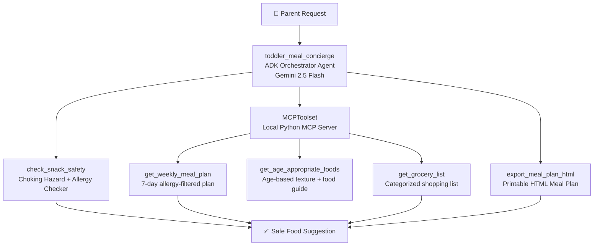
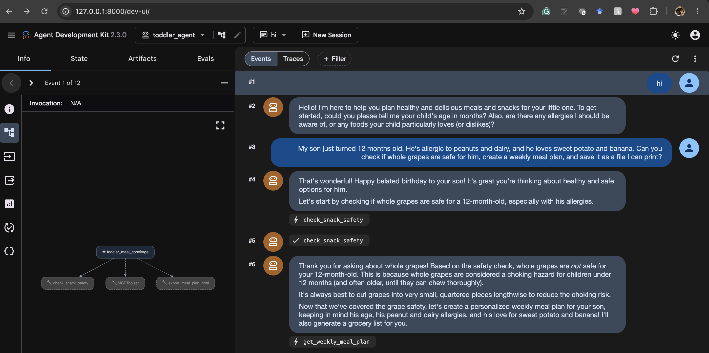
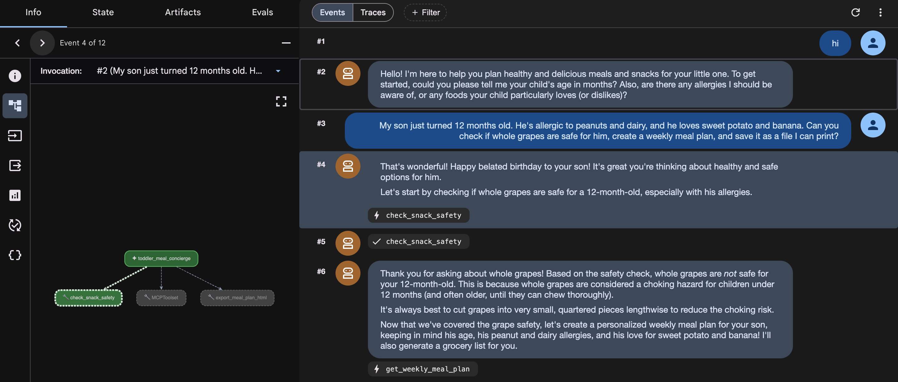
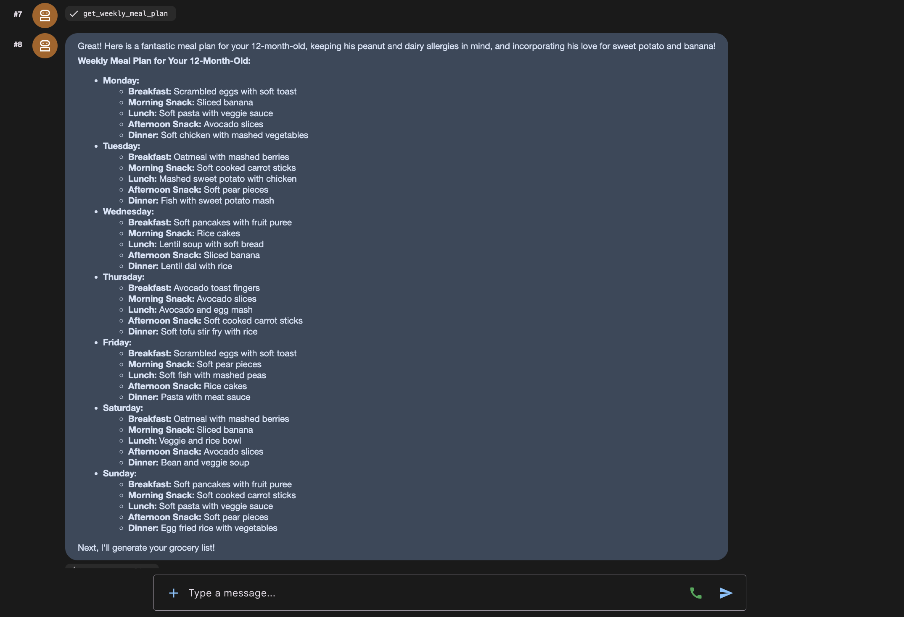
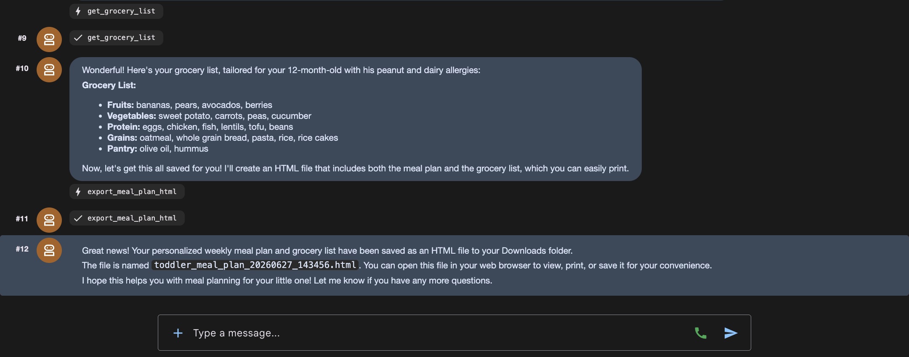
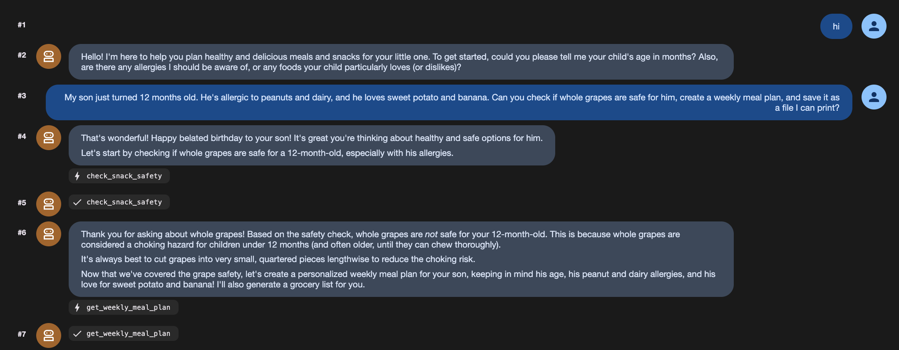
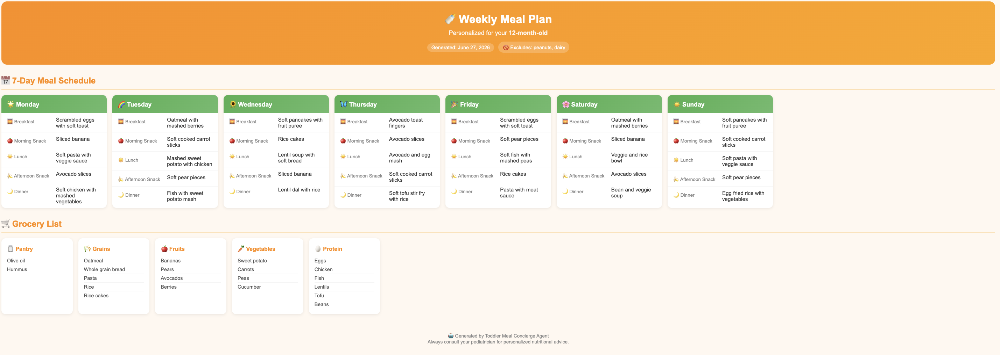

# 🍎 Toddler Meal Planning Concierge Agent

A personal AI concierge agent that helps parents plan safe, age-appropriate meals and snacks for their toddlers — built with Google ADK, Gemini 2.5 Flash, and a local MCP server.

## The Problem

Parents of toddlers face a daily challenge: planning meals that are:
- **Safe** — avoiding choking hazards specific to the child's age
- **Allergy-aware** — filtering out known allergens
- **Age-appropriate** — matching food textures to developmental stage
- **Practical** — easy to prepare with a real grocery list

Searching the internet or asking a generic chatbot gives inconsistent, unverified answers. This agent solves that with deterministic safety checks and structured meal planning tools.

## Features

- 🔍 **Age-aware safety checking** — detects choking hazards by age in months
- 🚫 **Allergy filtering** — removes allergens from every suggestion and plan
- 📅 **7-day meal planning** — breakfast, snacks, lunch and dinner for a full week
- 🛒 **Grocery list generation** — categorized shopping list from the weekly plan
- 📄 **HTML export** — beautiful printable meal plan parents can save or print
- 🔒 **Security layer** — input validation and prompt injection protection
- 🖥️ **Web UI** — clean browser interface via ADK web server

## Demo Video (Placeholder)

[](https://www.youtube.com/watch?v=YOUR_YOUTUBE_VIDEO_ID)

*Click to watch the full demo on YouTube — replace with actual video ID after recording*

## Why Agents?

Unlike a standard chatbot, this agent:
- Calls **verified tools in sequence** rather than generating text from memory
- Runs **deterministic safety checks** before suggesting any food
- Orchestrates **multiple MCP tools** to build a complete weekly plan
- Produces a **structured grocery list** automatically — without being asked

## Architecture

The orchestrator agent receives natural language requests from parents and delegates to specialized tools:

- **toddler_meal_concierge** — ADK orchestrator agent powered by Gemini 2.5 Flash
- **check_snack_safety** — deterministic safety checker for choking hazards and allergens
- **MCPToolset** — local Python MCP server exposing three nutrition tools:
  - `get_age_appropriate_foods` — returns safe textures and foods by age in months
  - `get_weekly_meal_plan` — generates a 7-day allergy-filtered meal plan
  - `get_grocery_list` — produces a categorized shopping list
- **export_meal_plan_html** — generates a printable HTML meal plan file

The agent always calls `check_snack_safety` before suggesting any food, ensuring deterministic safety validation rather than relying on the LLM's memory.



## Screenshots

### Agent Web UI — Tool Orchestration


### Tool Calls in Action


### Weekly Meal Plan Response


### Export HTML Meal Plan


### Safety Check — Choking Hazard Detection


### Generated HTML Meal Plan


## Course Concepts Demonstrated

| Concept | Implementation |
|---|---|
| Agent / Multi-agent system (ADK) | Orchestrator agent with tool delegation |
| MCP Server | Local Python MCP server with 3 nutrition tools |
| Security features | Input validation, prompt injection detection, ADC auth |
| Agent skills | HTML export tool, safety checker, meal planner |

## Setup Instructions

### Prerequisites
- Python 3.11+
- Google Cloud account with Vertex AI API enabled
- gcloud CLI installed and authenticated

### Installation

```bash
# Clone the repo
git clone https://github.com/SangaviKS/toddler-meal-agent.git
cd toddler-meal-agent

# Create virtual environment
python3 -m venv venv
source venv/bin/activate

# Install dependencies
pip install google-adk mcp python-dotenv
```

### Authentication

```bash
gcloud auth application-default login
gcloud auth application-default set-quota-project YOUR_PROJECT_ID
```

### Configuration

Create a `.env` file (never commit this):
```
GOOGLE_CLOUD_PROJECT=your_project_id
GOOGLE_CLOUD_LOCATION=global
GOOGLE_GENAI_USE_VERTEXAI=true
```

### Run the Agent

**Terminal mode:**
```bash
adk run toddler_agent
```

**Web UI mode:**
```bash
adk web
```
Then open http://127.0.0.1:8000

## Example Interactions

### 🍇 Safety Check + Weekly Meal Plan + Export (All-in-One)
> *"My son just turned 12 months old. He's allergic to peanuts and dairy, and he loves sweet potato and banana. Can you check if whole grapes are safe for him, create a weekly meal plan, and save it as a file I can print?"*

**What the agent does:**
1. 🔍 Calls `check_snack_safety` → ⚠️ Flags whole grapes as a choking hazard for 12-month-olds and suggests quartering them
2. 📋 Calls `get_age_appropriate_foods` → Identifies soft, small piece textures appropriate for 12 months
3. 🗓️ Calls `get_weekly_meal_plan` → Generates a 7-day plan excluding peanuts and dairy, featuring sweet potato and banana
4. 🛒 Calls `get_grocery_list` → Produces a categorized, allergen-free shopping list
5. 💾 Calls `export_meal_plan_html` → Saves a beautiful printable HTML file to Downloads folder

---

### 🍌 Simple Snack Suggestion
> *"My daughter is 14 months old, allergic to peanuts and loves bananas. What snack can I give her?"*

**What the agent does:**
1. 🔍 Calls `check_snack_safety` → ✅ Confirms sliced bananas are safe for 14 months
2. 💬 Explains why bananas are age-appropriate, nutritious, and allergy-safe

---

### 🚨 Choking Hazard Detection
> *"My son is 10 months old. Can he eat whole grapes?"*

**What the agent does:**
1. 🔍 Calls `check_snack_safety` → ⚠️ Flags whole grapes as a choking hazard under 12 months
2. 💬 Suggests safe alternative: quarter grapes lengthwise before serving


## Security

- No API keys in code — uses Google Application Default Credentials (ADC)
- Child profile data (allergies, age) never stored or logged
- All food suggestions pass deterministic safety validation before reaching the parent
- `.env` excluded from version control via `.gitignore`

## Tech Stack

- **Google ADK** 2.3.0
- **Gemini 2.5 Flash** via Vertex AI
- **MCP (Model Context Protocol)** — local Python server
- **Python** 3.14
- **Google Cloud Vertex AI**

## Track

Concierge Agents — simplifying everyday family life while keeping child data safe and secure.