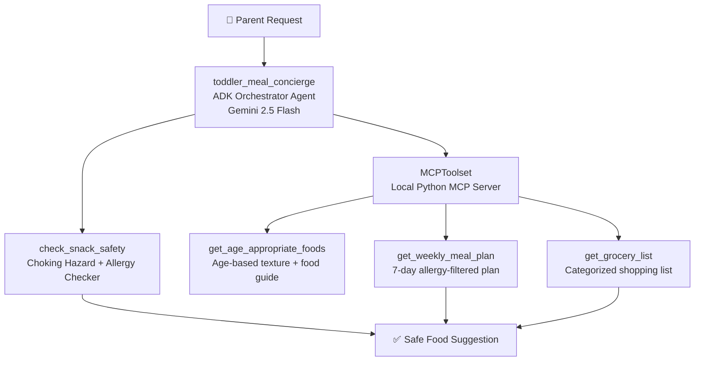

# 🍌 Toddler Meal Planning Concierge Agent

A personal AI concierge agent that helps parents plan safe, age-appropriate meals and snacks for their toddlers — built with Google ADK, Gemini 2.5 Flash, and a local MCP server.

## The Problem

Parents of toddlers face a daily challenge: planning meals that are:
- **Safe** — avoiding choking hazards specific to the child's age
- **Allergy-aware** — filtering out known allergens
- **Age-appropriate** — matching food textures to developmental stage
- **Practical** — easy to prepare with a real grocery list

Searching the internet or asking a generic chatbot gives inconsistent, unverified answers. This agent solves that with deterministic safety checks and structured meal planning tools.

## Why Agents?

Unlike a standard chatbot, this agent:
- Calls **verified tools in sequence** rather than generating text from memory
- Runs **deterministic safety checks** before suggesting any food
- Orchestrates **multiple MCP tools** to build a complete weekly plan
- Produces a **structured grocery list** automatically — without being asked

## Architecture

The orchestrator agent receives natural language requests from parents and delegates to specialized tools:

- **toddler_meal_concierge** — ADK orchestrator agent powered by Gemini 2.5 Flash
- **check_snack_safety** — deterministic safety checker for choking hazards and allergens
- **MCPToolset** — local Python MCP server exposing three nutrition tools:
  - `get_age_appropriate_foods` — returns safe textures and foods by age in months
  - `get_weekly_meal_plan` — generates a 7-day allergy-filtered meal plan
  - `get_grocery_list` — produces a categorized shopping list

The agent always calls `check_snack_safety` before suggesting any food, ensuring deterministic safety validation rather than relying on the LLM's memory.



## Course Concepts Demonstrated

| Concept | Implementation |
|---|---|
| Agent / Multi-agent system (ADK) | Orchestrator agent with tool delegation |
| MCP Server | Local Python MCP server with 3 nutrition tools |
| Security features | Allergy filtering, input validation, ADC authentication |

## Setup Instructions

### Prerequisites
- Python 3.11+
- Google Cloud account with Vertex AI API enabled
- gcloud CLI installed and authenticated

### Installation

```bash
# Clone the repo
git clone https://github.com/SangaviKS/toddler-meal-agent.git
cd toddler-meal-agent

# Create virtual environment
python3 -m venv venv
source venv/bin/activate

# Install dependencies
pip install google-adk mcp python-dotenv
```

### Authentication

```bash
gcloud auth application-default login
gcloud auth application-default set-quota-project YOUR_PROJECT_ID
```

### Configuration

Create a `.env` file (never commit this):
GOOGLE_CLOUD_PROJECT=your_project_id

GOOGLE_CLOUD_LOCATION=global

GOOGLE_GENAI_USE_VERTEXAI=true

### Run the Agent

**Terminal mode:**
```bash
adk run toddler_agent
```

**Web UI mode:**
```bash
adk web
```
Then open http://127.0.0.1:8000

## Example Interactions

**Snack suggestion:**
Parent: My daughter is 14 months old, allergic to peanuts and loves bananas. What snack can I give her?

Agent: [checks safety] Sliced bananas are perfect! Here's why they're safe and nutritious for a 14-month-old...

**Weekly meal plan:**
Parent: Can you give me a weekly meal plan and grocery list?

Agent: [calls get_age_appropriate_foods → get_weekly_meal_plan → get_grocery_list]

Here's a 7-day peanut-free plan with a categorized grocery list...

## Security

- No API keys in code — uses Google Application Default Credentials (ADC)
- Child profile data (allergies, age) never stored or logged
- All food suggestions pass deterministic safety validation before reaching the parent
- `.env` excluded from version control via `.gitignore`

## Tech Stack

- **Google ADK** 2.3.0
- **Gemini 2.5 Flash** via Vertex AI
- **MCP (Model Context Protocol)** — local Python server
- **Python** 3.14
- **Google Cloud Vertex AI**

## Track

Concierge Agents — simplifying everyday family life while keeping child data safe and secure.